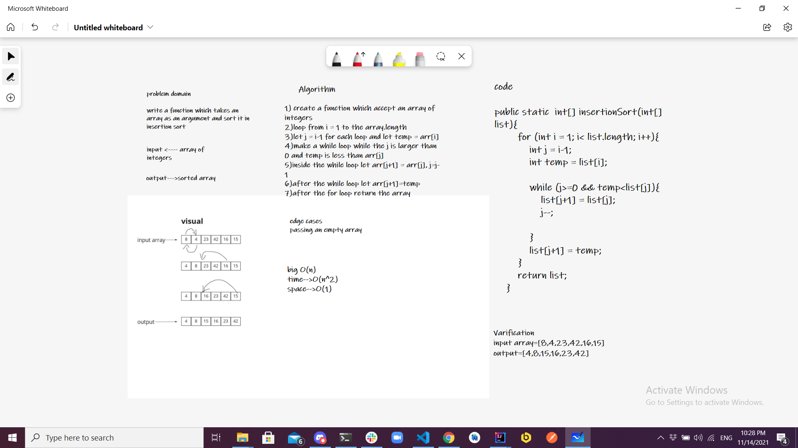
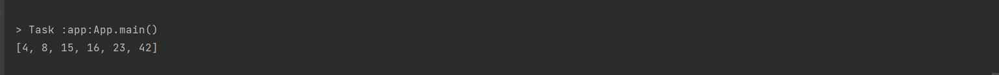

# Challenge Summary
write a function which takes an array as an argument, and sort it in Insertion Sort algorithm.

## Whiteboard Process


## Approach & Efficiency
the big O notation is :
Time: O(n^2)
Space: O(1)

## Solution
example of how to use the function:

```
 int[] testing = {8,4,23,42,16,15};
        System.out.println(Arrays.toString(insertionSort(testing)));
```

