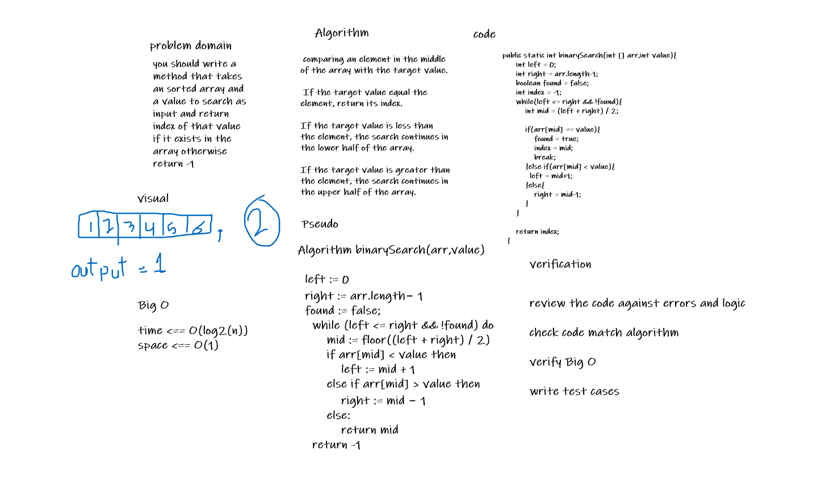

# array-binary-search
write method to search for element in sorted array using binary search algorithm.

## Whiteboard Process

## Approach & Efficiency

this approach is optimal for searching in soered array and the time complexity is O(log2(n)) and space is O(1).