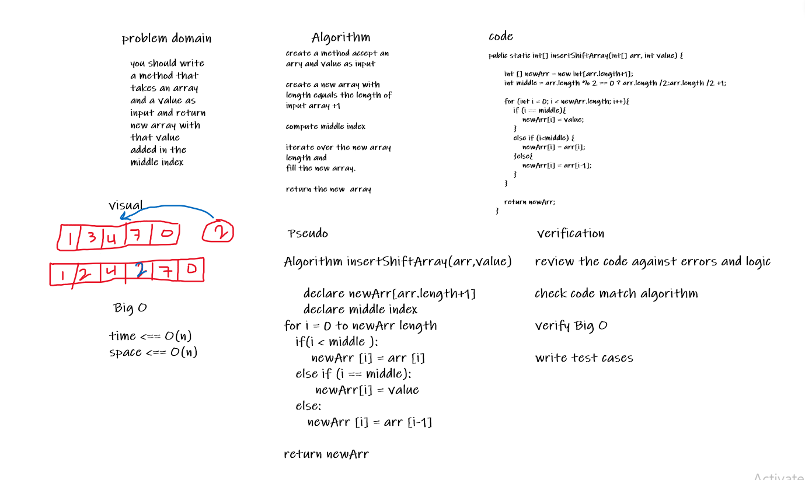

# Array Insert && shift
write method to insert element in the middle of the array;

## Whiteboard Process

## Approach & Efficiency

this approach added element in the middle of the array by using helper array and the time complexity is O(n) and space is O(n).