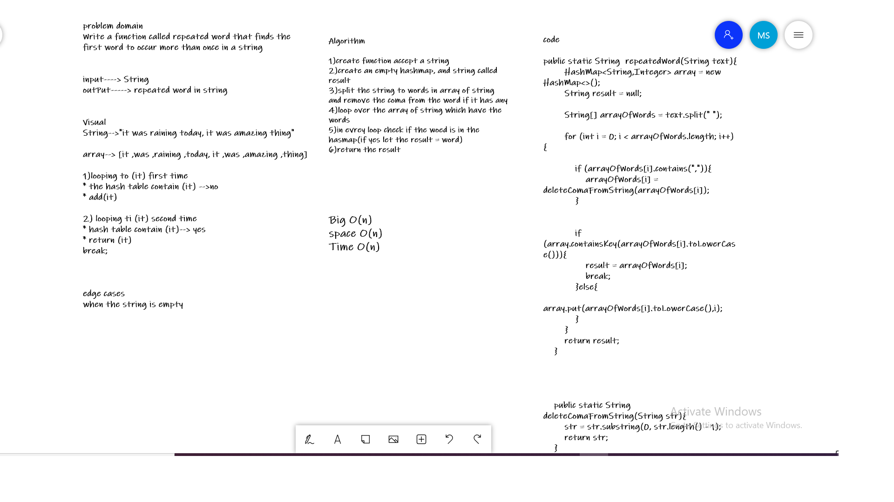
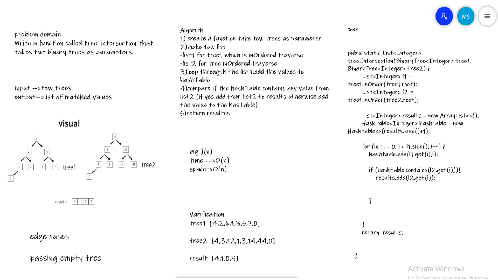
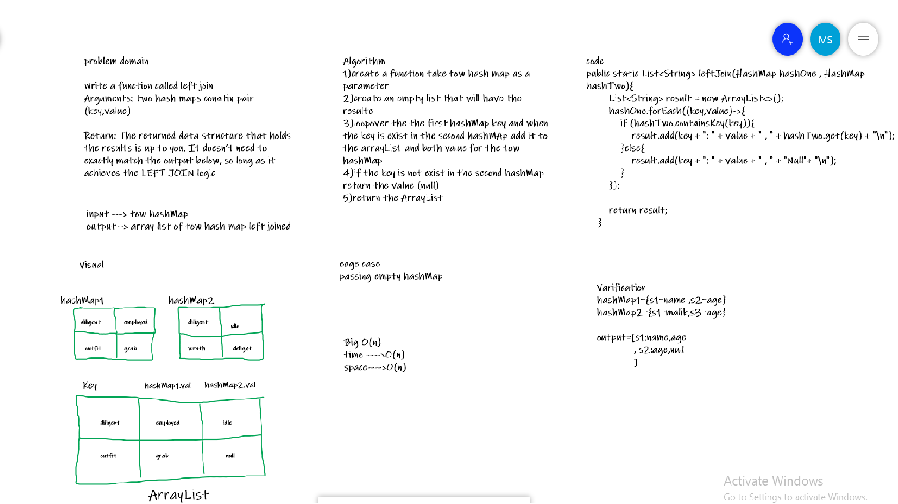

# Hashtables

Hash tables is an algorithm that stores the keys into hash buckets, which contain key-value pairs. Since different keys may hash to the same bucket, the goal of hash table design is to spread out the key-value pairs evenly with each bucket containing as few key-value pairs as possible. When an item is looked up, its key is hashed to find the appropriate bucket, and the bucket is then compared to find the right key-value pair.

## Challenge

implement HashTable class with 4 methods ( hash ,add , contains , get).

## Approach & Efficiency

the big O notation is big O(n) for the time and space because the use of while loop and the use of array.

## API

1. hash(): takes a key and convert it to an integer index.
2. add(): to add a new key-value pair to the hash table.
3. get(): to check and return the value of the given key.
4. contains: to check if the key exists in the hash table and returns a boolean indicates if true or false.

# code challenge 31 (HashMap)

Write a function called repeated word that finds the first word to occur more than once in a string

## Whiteboard 



## Approach & Efficiency

using a loop and creating new array the big O(n) will become:

time--> O(n) 
space--> O(n)
## Solution

example of how to use the code:

```
String words = "It was the best of times, it was the worst of times,";
        System.out.println(repeatedWord(text));
```
here is the output of it:


### Challenge 32

### find a set of values found in both trees.



### Approach & Efficiency
Time : o(n)
Space:o(n)

### API

* treeIntersection: takes two binary trees as parameters,
  Using Hashmap implementation ,return a set of values found in both trees.


### Challenge 33
# Hashmap LEFT JOIN

Implement a simplified LEFT JOIN for two Hashmaps.

## Challenge

Write a function that LEFT JOINs two hashmaps into a single data structure.

## Approach & Efficiency

the big O notation of the function is :
time complexity = O(n)   
space complexity = O(n)  

## API
takes two hashMap as parameters, Looping over them and return  an array contain the matched key with the value of it.

## Solution

