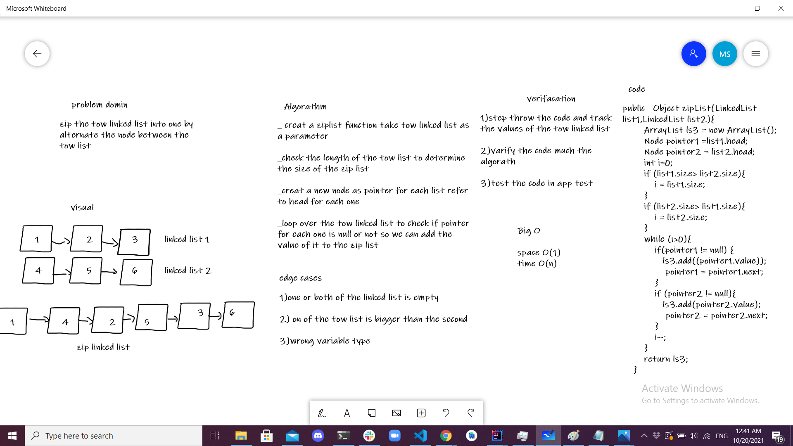

# Linked List
## code challenge 5

## Whiteboard Process

## Approach & Efficiency
write the data structure Linked List with function:
* insert :to add node
* include : to find if the wanted value in on the linked List
* toString : to print the value of the linked list
________________________________________________________
insert method:
Time O(1)
Space O(1)
include method :
Time O(n)
Space O(1)
toString method:
Time O(n)
Space O(1)
append()
Time O(n)
Space O(1)
insertBefore()
Time O(n)
Space O(1)
insertAfter()
Time O(n)
Space O(1)

## code challenge 6
## linked-list-insertion

## Approach & Efficiency
append()
Time O(n)
Space O(1)
insertBefore()
Time O(n)
Space O(1)
insertAfter()
Time O(n)
Space O(1)

## API
* append
  * Arguments: value
  * Returns: nothing
  * adds a new node with the given value to the end of the list
* insert before
  * arguments: value, new value
  * Returns: nothing
  * adds a new node with the given new value immediately before the first node that has the value specified
* insert after
  * arguments: value, new value
  * Returns: nothing
  * adds a new node with the given new value immediately after the first node that has the value specified

--------------------------------------

## code challenge 7
## linked-list-kth

## Approach & Efficiency
* Step through the code and keep track of the linked list's values in a table.
* Count from the tail of the linkedlist until you reach the element number (k.
* Verify the large O of the written code.
* Make sure the code matches the algorithm.
* Explanatory testing based on inputs and outputs.
* The linked list.

## code challenge 8
## Zip two linked lists
Write a function named zip lists that can combine two linked lists into one, with nodes alternating between the two lists, and return a reference to the zipped list's head.

## Approach & Efficiency
* tow linked lists as input
* To determine the number of iterations required, check the length of two linked lists and save the maximum length in a variable (use max as a counter).
* Create a new node with a pointer to the head of linked list 1 and another pointer to the head of linked list 2. Iterate over two linked lists, checking if either of the pointers is null. If not, we add the value to new linked list 3 and lower the counter by one.
* return the connected list 3.

