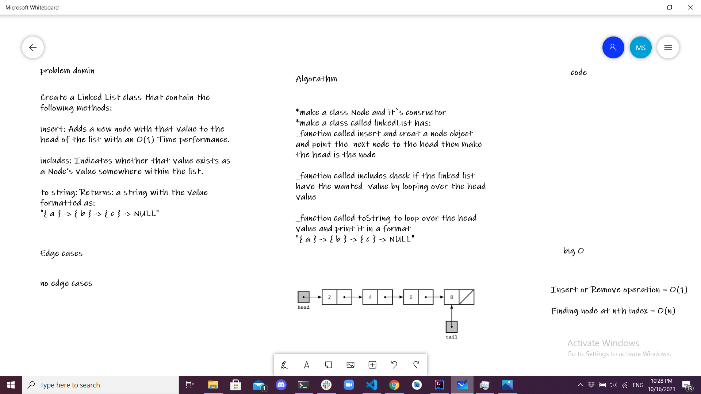

# Linked List

write the data structure Linked List with function:
* insert :to add node
* include : to find if the wanted value in on the linked List
* toString : to print the value of the linked list 

## Whiteboard Process

## Approach & Efficiency

 It is a data structure consisting of a collection of nodes which together represent a sequence.in this data structure element points to the next.
