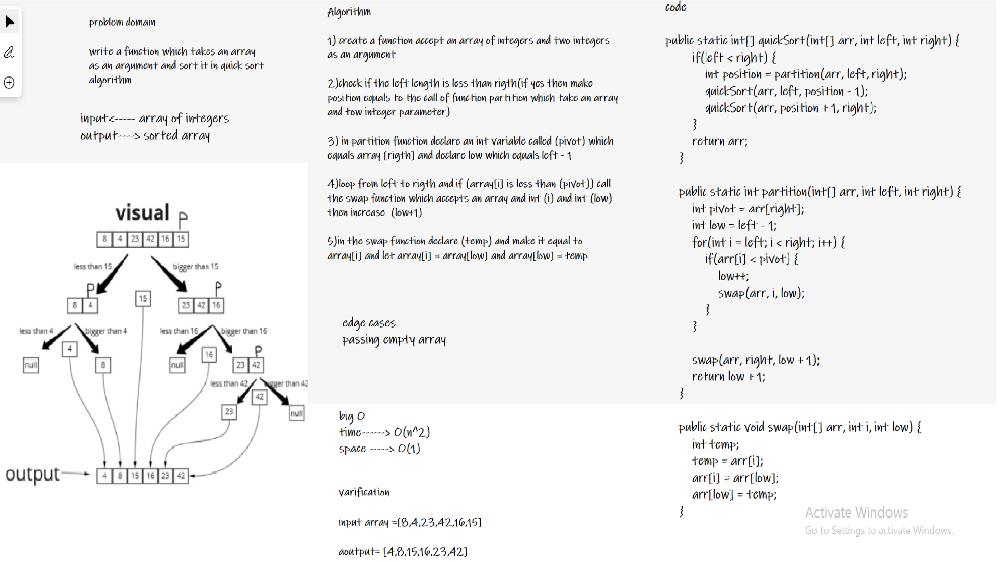
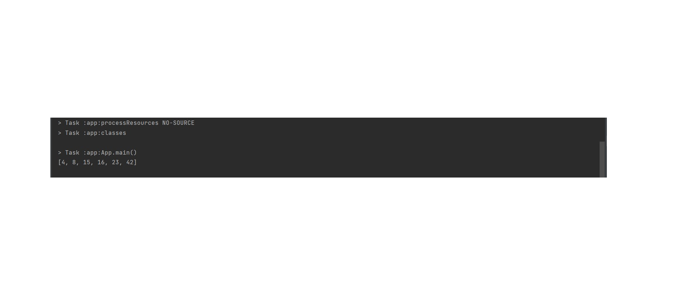

# Challenge Summary

write a function that takes an array as an argument, and sort it in (quick sort) algorithm.

## Whiteboard Process



## Approach & Efficiency

Time complexity: O(n^2)

Space complexity: O(1)

## Solution
example:

```
 int[] testing = {8,4,23,42,16,15};
System.out.println(Arrays.toString(quickSort(testing, 0, testing.length-1)));
```

output:

