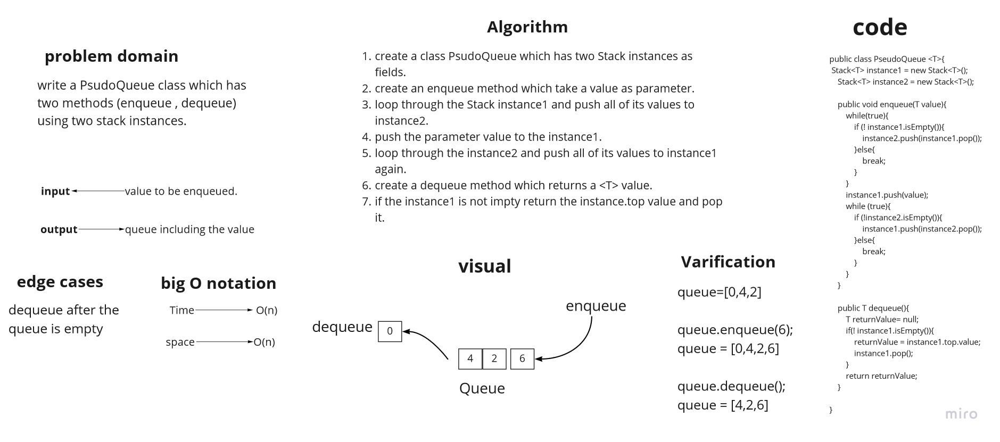
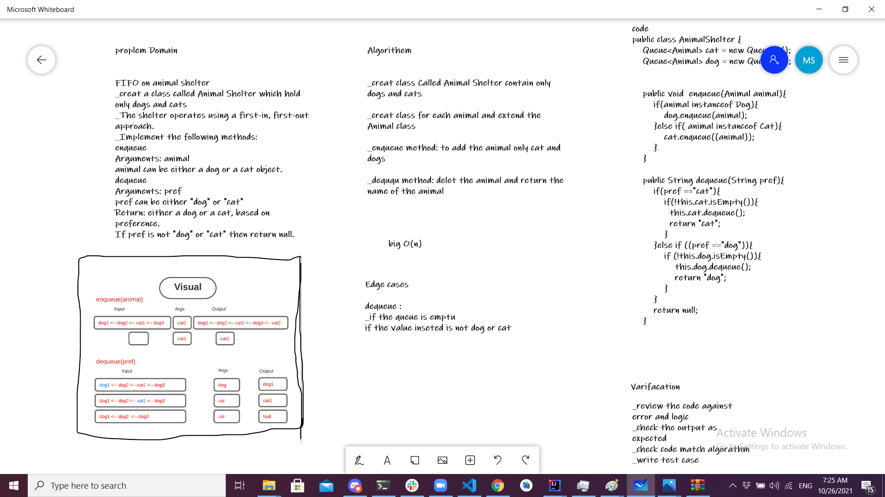
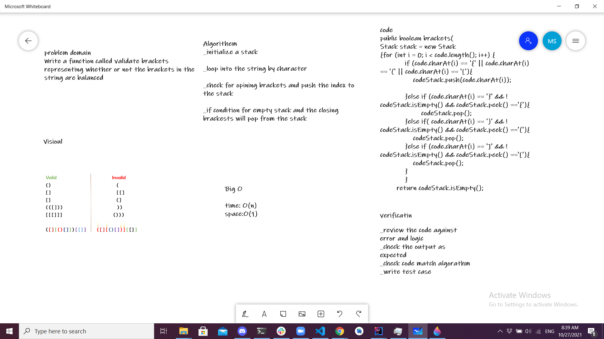

# Stacks and Queues
the program able to implement stack and queue using linked list

## Challenge #10
## Create a Stack class that has a top property. 

The class should contain the following methods:
* push:adds a new node with that value to the top of the stack.
* pop:Returns the value from node from the top of the stack ,Removes the node from the top of the stack
* peek : Returns: Value of the node located at the top of the stack
* is empty :Returns: Boolean indicating whether the stack is empty.

## Create a Queue class that has a front property.

The class should contain the following methods:
* enqueue:adds a new node with that value to the back of the queue
* dequeue:Returns the value from node from the front of the queue Removes the node from the front of the queue
* peek :Returns: Value of the node located at the front of the queue
* is empty :Returns Boolean indicating whether or not the queue is empty

## Approach & Efficiency

* push  and enqueue method:

  * Time O(1)
  * Space O(1)
* pop  and dequeue method :
  * Time O(1)
  * Space O(1)
* peek method:
  * Time O(1)
  * Space O(1)
* is empty
  * Time O(1)
  * Space O(1)
  
## API
* Create a top attribute for the Stack class.
* The following methods should be included in the class:
* push:pushes that value to the top of the stack as a new node.
* pop:Returns the value of the top-of-the-stack node,
* peek: removes the node from the stack's top: Returns: The node at the top of the stack's value is empty: Returns a Boolean value indicating whether the stack is empty or not.
* Create a front property in the Queue class.
* The following methods should be included in the class:
* enqueue: adds the item to the rear of the queue as a new node.
* dequeue:Returns the value from the queue's first node. Removes the node from the queue's front.

________________________________________________________
## Challenge #11
create a PseudoQueue class which have two Stack instances as fields, and two methods : enqueue , dequeue.

## Whiteboard Process

## Approach & Efficiency
* enqueue
  * time complexity will be O(n)
  * space o(n)
* deQueue
  * time complexity will be O(1)
  * space o(1)
  
## Solution
enqueue(x)
While stack1 is not empty, push everything from stack1 to stack2.
Push x to stack1 (assuming size of stacks is unlimited).
Push everything back to stack1.
deQueue:
If stack1 is empty then error
Pop an item from stack1 and return it

## Challenge #12
create a PseudoQueue class which have two Stack instances as fields, and two methods : enqueue , dequeue.

## Whiteboard Process

## Approach & Efficiency

enqueue
* time complexity will be O(n)
* space o(1)
* deQueue
  * time complexity will be O(1)
  * space o(1)
-------------------------------------------------

## Challenge #13
create a PseudoQueue class which have two Stack instances as fields, and two methods : enqueue , dequeue.

## Whiteboard Process

## Approach & Efficiency

enqueue
* time complexity will be O(n)
* space o(1)

## Solution
>public static boolean validateBrackets(String mycode){
Stack<Character> Stack = new Stack<>();

        for (int i = 0; i < mycode.length(); i++) {
            if (mycode.charAt(i) == '{' || mycode.charAt(i) == '(' || mycode.charAt(i) == '['){
                Stack.push(mycode.charAt(i));

            }else if (mycode.charAt(i) == '}' && !Stack.isEmpty() && Stack.peek() == "{"){
                Stack.pop();
            }else if( mycode.charAt(i) == ')' && !Stack.isEmpty() && Stack.peek() == "("){
                Stack.pop();
            }else if (mycode.charAt(i) == ']' && !Stack.isEmpty() && Stack.peek() == "["){
                Stack.pop();
            }
        }

        return Stack.isEmpty();
    }

