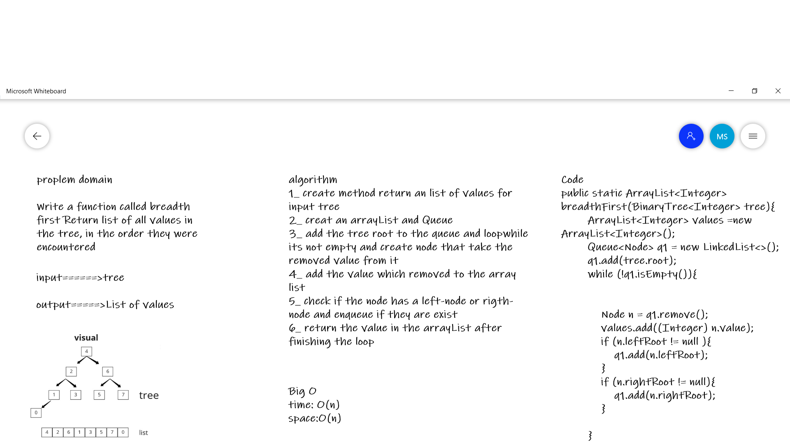
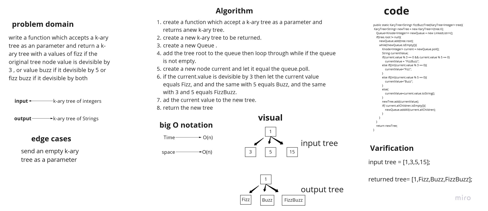

# Trees
Tree is a non-linear data structure that represents hierarchical data using connected nodes. It has a root node with 0 or more children up to 2 children, and this applies to every child node.


## Challenge
implement Binary tree and Binary Search tree.


* Node

* Create a Node class that has properties for the value stored in the node, the left child node, and the right child node.

* Binary Tree

* Create a Binary Tree class
* Define a method for each of the depth first traversals:
  1) pre order
  2) in order
  3) post order which returns an array of the values, ordered appropriately.
* Binary Search Tree

 * Create a Binary Search Tree class
 * This class should be a sub-class (or your languages equivalent) of the Binary Tree Class, with the following additional methods:
 * Add
   1-Arguments: value
   2-Return: nothing
   3-Adds a new node with that value in the correct location in the binary search tree.
* Contains
  1-Argument: value
  2-Returns: boolean indicating whether or not the value is in the tree at least once.

## Approach & Efficiency

* The Big O time complexity for inserting a new node = O(n).
* The Big O space complexity for a node insertion = O(n).
* The Big O time complexity for Serch node = O(n).
* The Big O space complexity for a node Search = O(n).


## API

* Add
    1. Start from the root.
    2. Compare the element to be inserted with the root node. If it is less than root, then traverse the left subtree or traverse the right subtree.
    3. Traverse the subtree till the end of the desired subtree. Insert the node in the appropriate subtree as a leaf node.

* Contains
    1. Compare the element to be searched with the root node.
    2. If the key (element to be searched) = root, return root node.
    3. Else if key < root, traverse the left subtree.
    4. Else traverse right subtree.
    5. Repetitively compare subtree elements until the key is found or the end of the tree is reached.


## Challenge 16
write a function Find the maximum value stored in the tree.

## Whiteboard Process


## Approach & Efficiency

* The Big O time complexity   = O(n).
* The Big O space complexity  = O(n).

## Solution
* example:
```
        BinarySearchTree<Integer> test = new BinarySearchTree<>(5);

        System.out.println(test.contains(4, test.root));
        test.add(4);
        test.add(8);
        test.add(3);
        System.out.println(test.contains(5,test.root));
        System.out.println(test.inOrder(test.root).toString());

        System.out.println(test.Max());
```
* output:
```
> Task :lib:Library.main()
false
true
[3, 4, 5, 8]
8
```

## Challenge 17
Write a function called breadth first Return list of all values in the tree, in the order they were encountered

## Whiteboard Process



## Approach & Efficiency

* The Big O time complexity   = O(n).
* The Big O space complexity  = O(n).

## Solution
* example:
```
        BinarySearchTree<Integer> test = new BinarySearchTree<>(5);

        System.out.println(test.contains(4, test.root));
        test.add(4);
        test.add(8);
        test.add(3);
       System.out.println(breadthFirst(test));
```
* output:
```
> Task :lib:Library.main()

[5, 4, 8, 3]
```


##Challenge 18
write a function which accepts a k-ary tree as an parameter and return a k-ary tree with a values of fizz if the original tree node value is devisible by 3 , or value buzz if it devisible by 5 or fizz buzz if it devisible by both

## Whiteboard Process


## Approach & Efficiency
* The Big O time complexity   = O(n).
* The Big O space complexity  = O(n).

## Solution
example:

```
        KaryTree<Integer> tree = new KaryTree<>(3);
        tree.add(3);
        tree.add(5);
        tree.add(15);
        tree.add(9);
        tree.add(20);
        tree.add(8);

        System.out.println(tree.breadthFirstSearch());
        System.out.println(KaryTree.fizzBuzzTree(tree).breadthFirstSearch());
```

output:
```
[Buzzz, Buzzz, FizzBuzzz, Fizzz, FizzBuzzz, 8, Fizzz, 1]
```